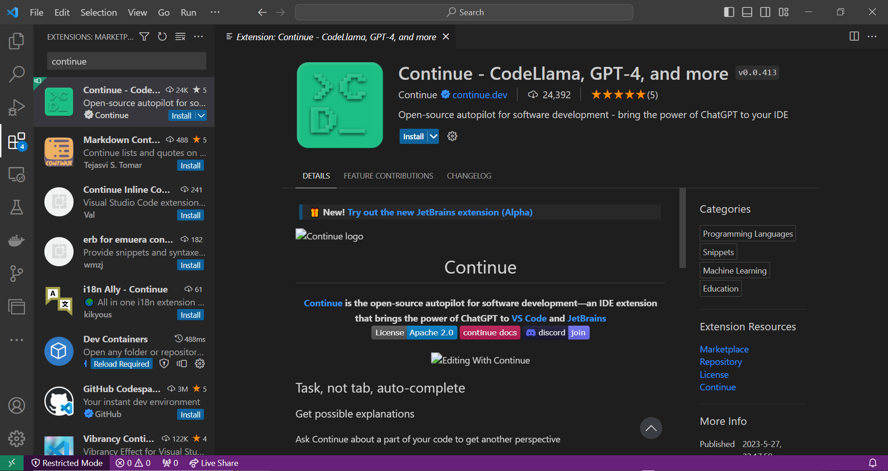
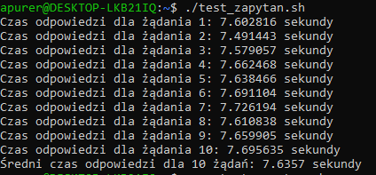

# projekt-markus

## Instalacja i uruchamianie

1. [Zainstaluj CUDA toolkit](https://developer.nvidia.com/cuda-toolkit)
2. [Zainstaluj Docker](https://docs.docker.com/desktop/install/windows-install/)
3. Aby uruchomić projekt, najpierw musisz załadować katalog `skrypty` a następnie uruchomić odpowiedni skrypt w zależności od używanego systemu operacyjnego.

### Dla systemów Windows:

1. Otwórz wiersz poleceń lub terminal w lokalizacji katalogu `skrypty`.
2. Uruchom skrypt:
```powershell
.\deploy.ps1
```

### Dla systemów Unix/Linux/macOS:

1. Otwórz terminal w lokalizacji katalogu skrypty.
2. Nadaj uprawnienia do uruchamiania dla skryptu deploy.sh:
```powershell
chmod +x deploy.sh
./deploy.sh
```

### Konfiguracja rozszerzenia **Continue** dla Visual Studio Code 

1. Zainstaluj plugin continue z Visual Studio Code marketplace

2. Skonfiguruj plik w lokalizacji ~/.continue/config.py na przykładzie pliku z folderu **continue**

### Jak korzystać rozszerzenia **Continue** dla Visual Studio Code 
"""
To jest 2-minutowy samouczek.

Zaprowadzi Cię przez podstawowe funkcje:
1. Zadaj pytanie
2. Edytuj kod
3. Debugowanie

Możesz albo:
- postępować zgodnie z instrukcjami samodzielnie, albo
- podążać za instrukcjami, klikając szare przyciski CodeLens powyżej linii, poczynając od "Rozpocznij Sekcję"
"""

#### region ———————————————————————————— Część 1: Zadaj pytanie o kod [⌘ M] ————————————————————————————

"""Krok 1: Zaznacz poniższą funkcję"""

def tajemnicza_funkcja(x):
    for i in range(len(x)):
        for j in range(len(x) - 1):
            if x[j] > x[j + 1]:
                x[j], x[j + 1] = x[j + 1], x[j]

    return x

"""Krok 2: Użyj skrótu klawiszowego [⌘ M], aby
zaznaczyć kod i włączyć pole wejściowe Continu"""

"""Krok 3: Zadaj pytanie i naciśnij Enter"""

#### endregion

#### region ———————————————————————————————— Część 2: Edytuj kod [⌘ ⇧ M] ————————————————————————————————

#### Krok 1: Zaznacz ten kod
def tajemnicza_funkcja(x):
    n = len(x)
    for i in range(n):
        swapped = False
        for j in range(0, n - i - 1):
            if x[j] > x[j + 1]:
                x[j], x[j + 1] = x[j + 1], x[j]
                swapped = True
        if swapped == False:
            break
    return x

"""Krok 2: Użyj skrótu klawiszowego [⌘ ⇧ M], aby
zaznaczyć kod i przełączyć polecenie /edit"""

"""Krok 3: Poproś o edycję i naciśnij Enter"""

"""Krok 4: Użyj skrótów klawiszowych, aby
zaakceptować [⌘ ⇧ ↵] lub odrzucić [⌘ ⇧ ⌫] edycję"""

#### endregion

#### region ————————————————————————————— Część 3: Debugowanie automatyczne [⌘ ⇧ R] ——————————————————————————

"""Krok 1: Uruchom ten plik Pythona"""

def drukuj_sumę(lista_do_druku):
    print(sum(lista_do_druku))

"""Krok 2: Użyj skrótu klawiszowego [⌘ ⇧ R]
do automatycznego debugowania błędu"""
drukuj_sumę(["a", "b", "c"])

#### endregion


## Wynik benchmarku inferencji modelu na CPU i GPU

### CPU, model codellama-13b.Q4_K_M.gguf 

| Czas operacji        | Czas (ms) | Szczegóły              | Tokens Per Second (TPS) |
|----------------------|-----------|------------------------|-------------------------|
| Ładowanie modelu     | 1052.52   | Czas ładowania modelu  | -                       |
| Czas próbkowania     | 7.37      | Czas próbkowania       | 8680.32                 |
| Czas komendy         | 323.17    | Czas oceny komendy     | 15.47                   |
| Czas ogólny          | 11578.22  | Całkowity czas oceny   | 5.44                    |
| Całkowity czas       | 11931.32  | Całkowity czas działania | -                       |

### GPU, model codellama-13b.Q4_K_M.gguf,  43 warstw na karcie graficznej

| Czas operacji      | Czas (ms) | Szczegóły               | Tokens Per Second (TPS) |
|--------------------|-----------|-------------------------|-------------------------|
| Ładowanie modelu   | 2748.62   | Czas ładowania modelu   | -                       |
| Czas próbkowania   | 40.12     | Czas próbkowania        | 8449.44                 |
| Czas komendy       | 89.10     | Czas oceny komendy      | 56.12                   |
| Czas ogólny        | 4423.76   | Całkowity czas oceny    | 76.41                   |
| Całkowity czas     | 4656.81   | Całkowity czas działania| -                       |

### CPU model luna-ai-llama2-uncensored.Q4_0.gguf

| Czas operacji      | Czas (ms) | Szczegóły              | Tokens Per Second (TPS) |
|-------------------|-----------|-----------------------|-------------------------|
| Ładowanie modelu  | 498.77    | Czas ładowania modelu | -                       |
| Czas próbkowania  | 4.55      | Czas próbkowania       | 8577.08                 |
| Czas komendy      | 183.46    | Czas oceny komendy     | 27.25                   |
| Czas ogólny       | 3734.98   | Całkowity czas oceny   | 10.17                   |
| Całkowity czas    | 3937.23   | Całkowity czas działania| -                      |

### GPU model luna-ai-llama2-uncensored.Q4_0.gguf 35 warstw na karcie graficznej

| Czas operacji      | Czas (ms) | Szczegóły              | Tokens Per Second (TPS) |
|-------------------|-----------|-----------------------|-------------------------|
| Ładowanie modelu  | 1290.72   | Czas ładowania modelu | -                       |
| Czas próbkowania  | 16.30     | Czas próbkowania       | 8713.26                 |
| Czas komendy      | 53.37     | Czas oceny komendy     | 93.69                   |
| Czas ogólny       | 1026.54   | Całkowity czas oceny   | 137.36                  |
| Całkowity czas    | 1135.82   | Całkowity czas działania| -                      |

### Test inferencji modelu luna-llama2 na CPU za pomocą zapytań w curl

